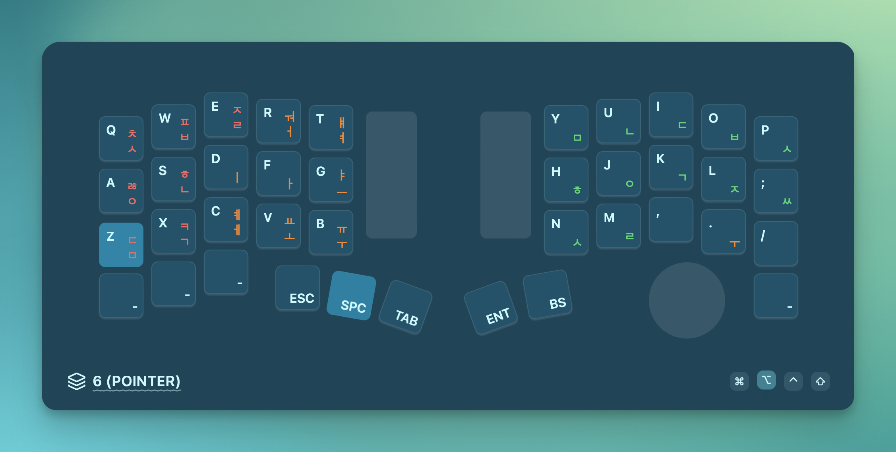

<p align="center">
  <h1>QMK Key Viewer</h1>
  
</p>

> [!WARNING]
> This program was created for personal use. It has not been properly tested and documented. It may have issues with its operation.


## Intro

- Visualizes key inputs from the QMK keyboard on the screen


## Getting Started

### Setup your keyboard

[QMK Setup](./qmk_setup.md)

### Run Program

```bash
git clone https://github.com/gangjun06/qmk-key-viewer
cd qmk-key-viewer
pnpm install
pnpm run tauri dev
```

## How it Works

The program fetches the console output from QMK and visualizes key inputs and layer.